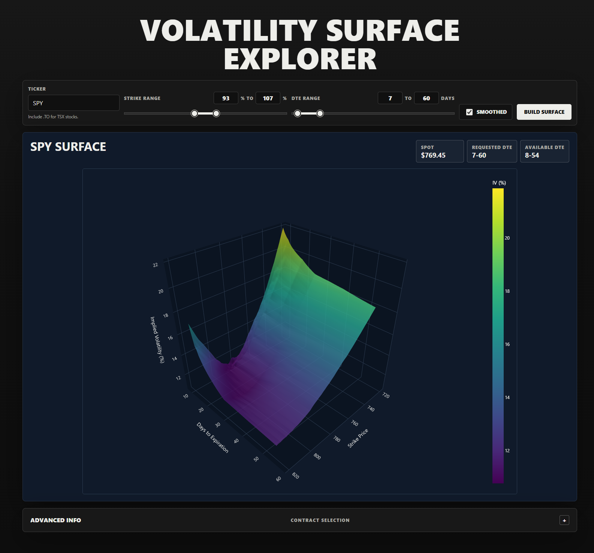

# Volatility Surface Explorer

Explore quote-derived implied-volatility surfaces for equity and ETF options.

**Live app:** [volexplorer.ca](https://www.volexplorer.ca/)

## Live Site Screenshot



Captured directly from the [live production site](https://www.volexplorer.ca/?ticker=SPY&strike_min_pct=93&strike_max_pct=107&dte_min=7&dte_max=60&smooth=1) on September 28, 2026, with SPY, strikes at 93%-107% of spot, a requested 7-60 DTE range, and smoothing enabled.

## Features

- Interactive Plotly 3D surfaces and adjusted quote-node views.
- Editable strike and DTE ranges, including zero-day expirations before the assumed expiration close.
- One unified call/put surface with out-of-the-money quote preference and liquidity/confidence weighting.
- Quote-derived Black-Scholes-Merton IV with expiry-specific forward estimates when usable put/call pairs are available.
- Contracts fetched and contracts actually used, with exactly one exclusion reason per excluded contract.
- Lightweight Flask homepage with deferred financial-library imports, Vercel edge caching, and versioned static assets.
- A retained CLI for HTML exports, detailed diagnostics, and optional external IV benchmarks.

## Methodology

1. Fetch the underlying price and option chains for expirations inside the requested DTE window.
2. Filter the requested strike/DTE range and derive the fractional pricing time remaining, excluding expired contracts.
3. Estimate each expiry's forward from put-call parity when enough paired quotes are available; otherwise use the configured dividend yield.
4. Select a usable quote price, usually a midpoint or an eligible recent-trade fallback, apply quote-quality and model-bound checks, and invert dividend-adjusted European Black-Scholes-Merton IV.
5. Reprice IV through the same model, convert puts to call-equivalent prices, and weight selected quotes by liquidity/confidence. Prefer OTM puts below the forward and OTM calls above it; near the forward, both sides can contribute.
6. Project call-price slices toward strike monotonicity and convexity, interpolate total variance on overlapping log-forward-moneyness grids, and apply calendar-variance control. If smoothing lacks enough stable nodes, render adjusted nodes instead.

DTE filtering uses the New York calendar date consistently in fetching and cleaning. Pricing uses the positive fractional time remaining to an assumed 4pm New York expiration close, with daylight-saving transitions respected. A zero-day contract is not treated as having zero pricing time and is excluded once that close is reached.

## Usage

### Recommended Setup
Create a local virtual environment and install the runtime dependencies from `requirements.txt`:

```bash
python -m venv .venv
```

On Windows PowerShell:

```powershell
.\.venv\Scripts\Activate.ps1
```

On macOS/Linux:

```bash
source .venv/bin/activate
```

Then install dependencies:

```bash
python -m pip install --upgrade pip
pip install -r requirements.txt
```

The `environment.yml` file is available if you prefer Conda or want a broader local data-science environment with Jupyter.

### Web App
```bash
python web_app.py
```

Open [127.0.0.1:5000](http://127.0.0.1:5000/). The web defaults are strikes at 93%-107% of spot, 7-60 DTE, and smoothing enabled. DTE controls accept 0-365 days, including a 0-0 window for same-day expirations before close.

Include `.TO` when searching for TSX stocks. An option chain must be available from Yahoo Finance; not every valid stock ticker has supported options data. `VIX` and `^VIX` are deliberately rejected with an explanation because the app does not implement VIX-specific forward pricing.

The web app uses server-rendered HTML/CSS/JS and shares its financial pipeline with the CLI. The live deployment can lag the repository while new changes are being tested in preview.

### Vercel Deployment

The repository includes `vercel.json`, `.vercelignore`, `api/index.py`, and `requirements.txt`. The deployment entrypoint imports the shared Flask app; caches, tests, documentation images, and local development artifacts are excluded from the deployment upload.

Create a preview from the linked project directory:

```bash
npx vercel deploy --target=preview
```

Production promotion is a separate, explicit step. The empty homepage can be cached at the Vercel edge; pages containing ticker results use `no-store` so old quote snapshots are not served as fresh builds.

### Tests

Install the test dependency and run the regression suite:

```bash
python -m pip install pytest
python -m pytest -q
```

Coverage includes pricing, quote selection, contract-count reconciliation, zero-day/overnight expiry boundaries, CLI behavior, and homepage import/cache regressions.

### Basic Usage
```bash
python main.py TICKER
```

### Smoothed Surface
```bash
python main.py TICKER --smooth
```

### Advanced Example
```bash
python main.py TICKER --smooth --dte_max 60 --quality_mode lenient --diagnostics_json diagnostics.json
```

### Same-Day Expirations

```bash
python main.py SPY --dte_min 0 --dte_max 0
```

This only returns contracts with positive pricing time remaining before the assumed expiration close.

## CLI Options
- `--strike_min_pct`: Min strike as percent of spot. Default: `0.93`.
- `--strike_max_pct`: Max strike as percent of spot. Default: `1.07`.
- `--dte_max`: Max calendar DTE. Default: `60`; accepted bounds: `0-365`.
- `--dte_min`: Min calendar DTE. Default: `1`; accepted bounds: `0-365`.
- `--smooth`: Build a smoothed unified surface.
- `--output_dir`: Output directory for HTML file.
- `--risk_free_rate`: Annualized risk-free rate for Black-Scholes. Default: `0.02`.
- `--dividend_yield`: Continuous dividend yield for Black-Scholes. Default: `0.0`.
- `--quality_mode {strict,balanced,lenient}`: Surface-inclusion confidence profile. Default: `lenient`.
- `--max_trade_age_hours`: Last-trade recency threshold for fallback pricing. Default: `120`.
- `--diagnostics_json`: Optional path for diagnostics JSON output.
- `--benchmark_csv`: Optional CSV for external IV comparison.
- `--include_low_confidence`: Include low-confidence rows in the surface fit instead of using the default confidence filter.

## Diagnostics

The web app's Advanced info shows:

- **Contracts fetched:** rows returned by the requested expiration chains, before strike and quote-quality filtering.
- **Contracts used:** the actual selected inputs to the fitter, after quality checks and quote-side selection.
- **Why contracts were excluded:** one primary reason per contract, including range exclusions and cases where an alternative quote was preferred.

The used count plus all exclusion counts equals the fetched count. Accepted recent-trade fallbacks are reported separately without counting them as exclusions.

Detailed quality flags, per-DTE confidence summaries, quote/forward provenance, and internal repricing validation remain available through CLI diagnostics. Multiple flags can describe one quote, so their totals are not the exclusive web exclusion counts. Internal repricing MAE/RMSE checks solver consistency, not independent market or predictive accuracy.

If `--benchmark_csv` is provided, additional external metrics are produced:
- Matched rows
- MAE / RMSE in vol points
- Per-option-type error summary

### Benchmark CSV Format
CSV must include:
- `optionType` (`call` or `put`)
- `strike`
- `days_to_expiration`
- `iv_ref`

The external benchmark compares cleaned quote-derived IV values, not the projected or interpolated surface grid.

## Notes on Surface Accuracy
- Black-Scholes-Merton IV is inverted from a selected usable option price. Uncertain quotes, invalid price bounds, unreliable IV, and unusable or stale prices can exclude a contract. An eligible recent-trade fallback can still be accepted when a two-sided quote is unavailable; those accepted trades are identified separately.
- The model is European Black-Scholes-Merton, not an American-option engine or an SVI calibration. It does not model early exercise or implement VIX-specific pricing.
- The 4pm New York close is a modeling assumption, not an exchange-specific settlement schedule for every instrument.
- Quote freshness and coverage depend on Yahoo Finance. The underlying-price lookup can fall back to history, so it is not a guaranteed real-time spot feed.
- Only listed expirations supply observed quotes. Dense smoothed maturities are interpolated, not additional observed option chains.
- Strike and calendar projections operate on a finite grid with a fixed number of passes. Small numerical violations can remain; the output is not a guarantee of globally exact arbitrage freedom.
- Low-confidence rows remain available for diagnostics but are excluded from the fit by default.

## Performance

The homepage does not import NumPy, pandas, SciPy, Plotly, or yfinance until a surface is requested. Surface builds reuse quote selection for both plotting and reporting, and exclusion accounting is vectorized.

On a replayed 2,687-contract SPY snapshot with matched settings, the September 28, 2026 local warm-build benchmark improved from about 4.06 seconds to 2.82 seconds, excluding Yahoo fetching and browser rendering. Fresh surface requests still require network access and fitting; this is not a sub-second fresh-surface guarantee.
